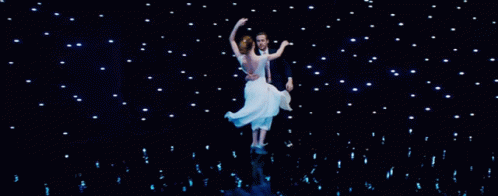

# La La Land e a Teoria das Cores
 

Este é um projeto individual que explora como o filme La La Land (2016), dirigido por Damien Chazelle, utiliza a teoria das cores para transmitir emoções, desenvolver personagens e contar sua história de forma visualmente poderosa.

 # Objetivo
 
Analisar de forma criativa a aplicação das cores em La La Land, destacando como cada escolha de cores contribui para:

- A construção da atmosfera das cenas;

- A evolução do relacionamento entre os protagonistas;

- A representação de sonhos e realidades.

 # Conceitos Abordados
 
- Teoria das cores: contraste, harmonia, psicologia das cores;

- Significado emocional das cores utilizadas;

- Estilo visual e identidade estética.
